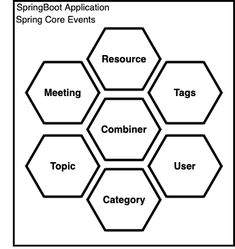

# Coffee-pot

This is a simple application, which implements a domain-centric "Hexagonal" approach and demonstrates [Microservice Architecture Pattern](http://martinfowler.com/microservices/) using Spring Boot.

We try to implement a simple list of topics for our internal java club.

## Domains
- Topic
- Tag
- User
- Category
- Meeting
- Resource

## Phase 0

In one single repo need to implement next items:
- Domain-centric "Hexagonal" approach for each domain
- Implement JPA (H2 in memory database) as OUT
- Add CRUD operations via REST (pagination) as IN
- Add Swagger
- Add simple event bus via Spring Core events as IN
- Add unit and integration tests

A final result of phase0 must be like this:

## Phase 1

TBD

# Launch Instructions

## 0. Go to project directory in Terminal

## 1. Build app & Dockerfile

`mvn clean install`

## 2. Run docker-compose

`cd src/main/docker`

`docker-compose up`

**What happens:**

1. Starts Spring boot application which populates database with some test data

## 3. Try it

Navigate to <http://localhost:8080/test> and enter credentials: 
* Username: 'lohika_user@gmail.com'
* Password: 'password123'

after this you will be redirected to request response.

## 4. Stop the app
`docker-compose down`

